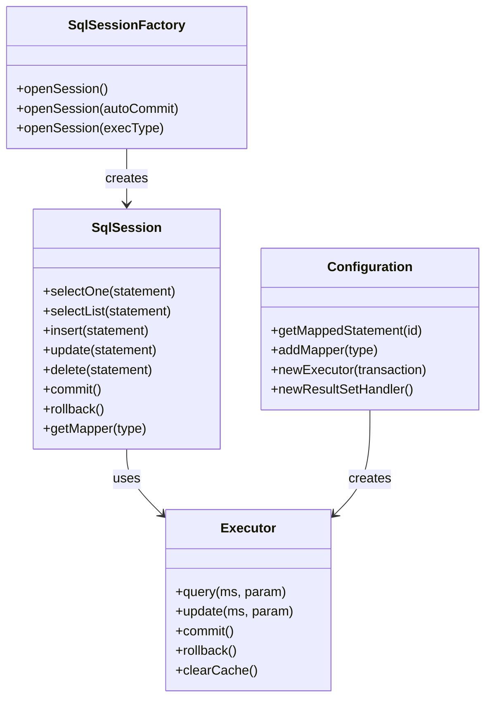
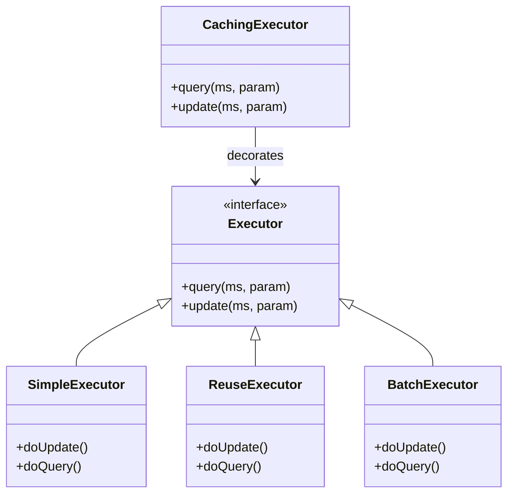
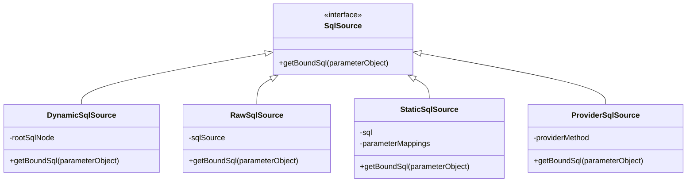
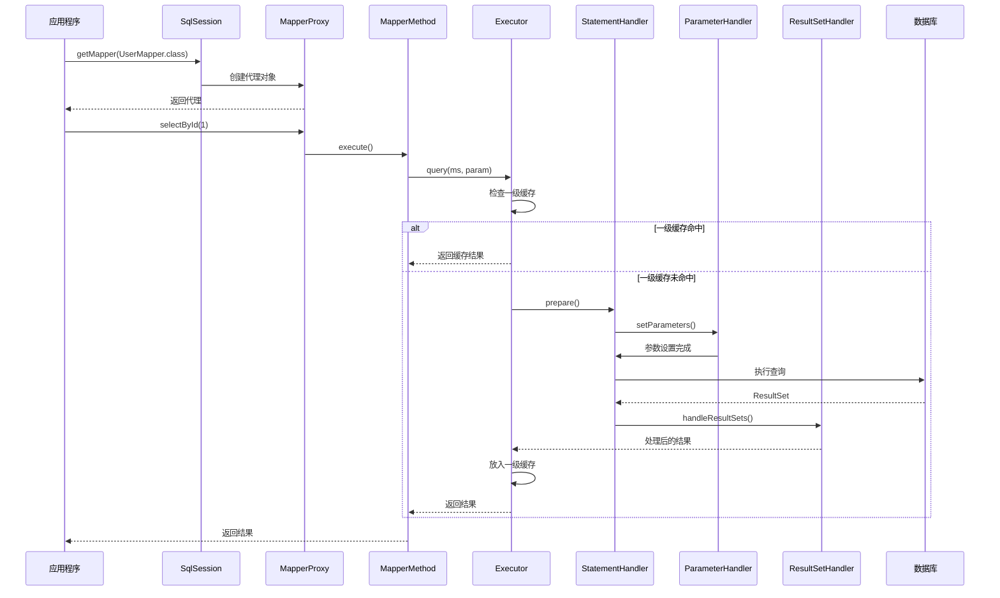
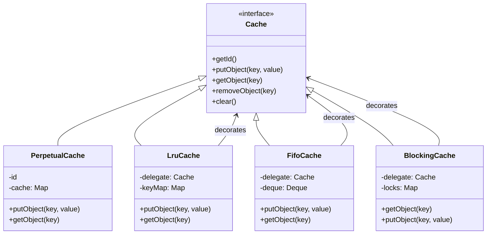
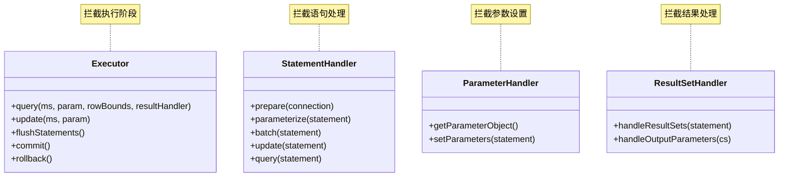
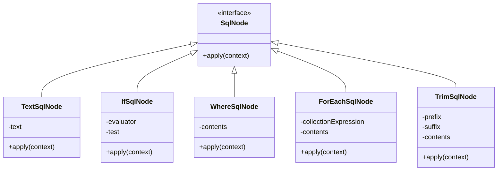
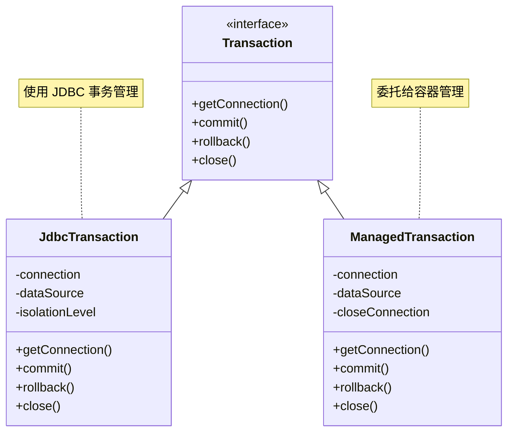

# MyBatis-3 源码详细分析文档

## 目录

1. [项目概述](#项目概述)
2. [核心架构](#核心架构)
3. [设计模式分析](#设计模式分析)
4. [核心组件详解](#核心组件详解)
5. [执行流程分析](#执行流程分析)
6. [缓存机制](#缓存机制)
7. [插件系统](#插件系统)
8. [类型处理系统](#类型处理系统)
9. [反射系统](#反射系统)
10. [动态SQL](#动态sql)
11. [事务管理](#事务管理)
12. [性能优化](#性能优化)

---

## 项目概述

### 1.1 项目简介

MyBatis 是一款优秀的持久层框架，它支持定制化 SQL、存储过程以及高级映射。MyBatis 避免了几乎所有的 JDBC 代码和手动设置参数以及获取结果集的工作。

### 1.2 项目结构

```
mybatis-3/
├── src/main/java/org/apache/ibatis/
│   ├── annotations/           # SQL 注解定义
│   ├── binding/              # Mapper 接口绑定机制
│   ├── builder/              # 配置构建器
│   ├── cache/                # 缓存框架
│   ├── cursor/               # 游标支持
│   ├── datasource/           # 数据源管理
│   ├── executor/             # SQL 执行引擎
│   ├── io/                   # IO 工具
│   ├── jdbc/                 # JDBC 工具
│   ├── logging/              # 日志抽象
│   ├── mapping/              # SQL 映射元数据
│   ├── parsing/              # XML 解析
│   ├── plugin/               # 插件系统
│   ├── reflection/           # 反射工具
│   ├── scripting/            # 动态 SQL 脚本
│   ├── session/              # 会话管理
│   ├── transaction/          # 事务管理
│   └── type/                 # 类型处理系统
```

---

## 核心架构

### 2.1 分层架构

MyBatis 采用经典的分层架构设计：

```
┌─────────────────────────────────────┐
│         API 层 (SqlSession)          │
├─────────────────────────────────────┤
│      数据处理层 (Executor)           │
├─────────────────────────────────────┤
│    语句处理层 (StatementHandler)     │
├─────────────────────────────────────┤
│    参数处理层 (ParameterHandler)     │
├─────────────────────────────────────┤
│    结果处理层 (ResultSetHandler)     │
├─────────────────────────────────────┤
│          JDBC 层 (Connection)        │
└─────────────────────────────────────┘
```

### 2.2 核心接口



---

## 设计模式分析

### 3.1 工厂模式 (Factory Pattern)

**应用场景：**
- `SqlSessionFactory` - 创建 SqlSession
- `ObjectFactory` - 创建对象实例
- `DataSourceFactory` - 创建数据源
- `TransactionFactory` - 创建事务

**代码示例：**
```java
// SqlSessionFactory.java:731-749
public Executor newExecutor(Transaction transaction, ExecutorType executorType) {
    executorType = executorType == null ? defaultExecutorType : executorType;
    Executor executor;
    if (ExecutorType.BATCH == executorType) {
        executor = new BatchExecutor(this, transaction);
    } else if (ExecutorType.REUSE == executorType) {
        executor = new ReuseExecutor(this, transaction);
    } else {
        executor = new SimpleExecutor(this, transaction);
    }
    if (cacheEnabled) {
        executor = new CachingExecutor(executor);
    }
    return (Executor) interceptorChain.pluginAll(executor);
}
```

### 3.2 建造者模式 (Builder Pattern)

**应用场景：**
- `SqlSessionFactoryBuilder` - 构建 SqlSessionFactory
- `MappedStatement.Builder` - 构建映射语句
- `CacheBuilder` - 构建缓存实例

**代码示例：**
```java
// MappedStatement.java:67-87
public static class Builder {
    private final MappedStatement mappedStatement = new MappedStatement();

    public Builder(Configuration configuration, String id, SqlSource sqlSource, SqlCommandType sqlCommandType) {
        mappedStatement.configuration = configuration;
        mappedStatement.id = id;
        mappedStatement.sqlSource = sqlSource;
        mappedStatement.statementType = StatementType.PREPARED;
        // ... 初始化默认值
    }

    public Builder resource(String resource) {
        mappedStatement.resource = resource;
        return this;
    }

    public MappedStatement build() {
        assert mappedStatement.configuration != null;
        return mappedStatement;
    }
}
```

### 3.3 代理模式 (Proxy Pattern)

**应用场景：**
- `MapperProxy` - Mapper 接口的动态代理
- `Plugin` - 插件代理
- 延迟加载代理

**代码示例：**
```java
// MapperProxy.java:58-68
@Override
public Object invoke(Object proxy, Method method, Object[] args) throws Throwable {
    try {
        if (Object.class.equals(method.getDeclaringClass())) {
            return method.invoke(this, args);
        }
        return cachedInvoker(method).invoke(proxy, method, args, sqlSession);
    } catch (Throwable t) {
        throw ExceptionUtil.unwrapThrowable(t);
    }
}
```

### 3.4 模板方法模式 (Template Method Pattern)

**应用场景：**
- `BaseExecutor` - 定义执行器骨架
- `BaseTypeHandler` - 类型处理器模板
- `BaseBuilder` - 构建器模板

**代码示例：**
```java
// BaseExecutor.java:112-119
@Override
public int update(MappedStatement ms, Object parameter) throws SQLException {
    ErrorContext.instance().resource(ms.getResource()).activity("executing an update").object(ms.getId());
    if (closed) {
        throw new ExecutorException("Executor was closed.");
    }
    clearLocalCache();
    return doUpdate(ms, parameter);  // 抽象方法，子类实现
}

protected abstract int doUpdate(MappedStatement ms, Object parameter) throws SQLException;
```

### 3.5 策略模式 (Strategy Pattern)

**应用场景：**
- `ExecutorType` - 不同的执行策略
- `Cache` - 不同的缓存策略
- `LanguageDriver` - 不同的语言驱动



### 3.6 装饰器模式 (Decorator Pattern)

**应用场景：**
- 缓存装饰器 (LruCache, FifoCache, SoftCache, WeakCache)
- `CachingExecutor` - 为执行器添加缓存功能

**代码示例：**
```java
// Configuration.java:745-748
if (cacheEnabled) {
    executor = new CachingExecutor(executor);  // 装饰基础执行器
}
```

### 3.7 责任链模式 (Chain of Responsibility Pattern)

**应用场景：**
- `InterceptorChain` - 插件拦截器链
- 多个插件按顺序拦截方法调用

**代码示例：**
```java
// InterceptorChain.java
public Object pluginAll(Object target) {
    for (Interceptor interceptor : interceptors) {
        target = interceptor.plugin(target);
    }
    return target;
}
```

### 3.8 注册表模式 (Registry Pattern)

**应用场景：**
- `MapperRegistry` - 注册 Mapper 接口
- `TypeHandlerRegistry` - 注册类型处理器
- `LanguageDriverRegistry` - 注册语言驱动

---

## 核心组件详解

### 4.1 Configuration 类

**职责：** MyBatis 的核心配置类，维护所有配置信息

**关键属性：**
```java
// Configuration.java:103-184
public class Configuration {
    // 环境配置
    protected Environment environment;

    // 各种配置开关
    protected boolean cacheEnabled = true;
    protected boolean lazyLoadingEnabled;
    protected boolean aggressiveLazyLoading;
    protected boolean mapUnderscoreToCamelCase;

    // 核心注册表
    protected final MapperRegistry mapperRegistry = new MapperRegistry(this);
    protected final InterceptorChain interceptorChain = new InterceptorChain();
    protected final TypeHandlerRegistry typeHandlerRegistry = new TypeHandlerRegistry(this);
    protected final TypeAliasRegistry typeAliasRegistry = new TypeAliasRegistry();

    // 映射语句和结果映射
    protected final Map<String, MappedStatement> mappedStatements;
    protected final Map<String, ResultMap> resultMaps;
    protected final Map<String, ParameterMap> parameterMaps;
    protected final Map<String, Cache> caches;
}
```

**关键方法：**
```java
// 创建各种处理器
public Executor newExecutor(Transaction transaction, ExecutorType executorType)
public ResultSetHandler newResultSetHandler(...)
public StatementHandler newStatementHandler(...)
public ParameterHandler newParameterHandler(...)
```

### 4.2 MappedStatement 类

**职责：** 表示一个映射的 SQL 语句

**关键属性：**
```java
// MappedStatement.java:35-62
public final class MappedStatement {
    private String id;                      // 唯一标识
    private SqlSource sqlSource;            // SQL 源
    private SqlCommandType sqlCommandType;  // SQL 命令类型
    private Cache cache;                    // 缓存
    private StatementType statementType;    // 语句类型
    private List<ResultMap> resultMaps;     // 结果映射
    private KeyGenerator keyGenerator;      // 主键生成器
    // ... 更多属性
}
```

### 4.3 SqlSource 接口体系



---

## 执行流程分析

### 5.1 完整执行流程图



### 5.2 查询执行详细流程

#### 5.2.1 查询入口

```java
// BaseExecutor.java:134-138
public <E> List<E> query(MappedStatement ms, Object parameter, RowBounds rowBounds, ResultHandler resultHandler)
    throws SQLException {
    BoundSql boundSql = ms.getBoundSql(parameter);
    CacheKey key = createCacheKey(ms, parameter, rowBounds, boundSql);
    return query(ms, parameter, rowBounds, resultHandler, key, boundSql);
}
```

#### 5.2.2 缓存键创建

```java
// BaseExecutor.java:199-243
public CacheKey createCacheKey(MappedStatement ms, Object parameterObject, RowBounds rowBounds, BoundSql boundSql) {
    CacheKey cacheKey = new CacheKey();
    cacheKey.update(ms.getId());           // MappedStatement ID
    cacheKey.update(rowBounds.getOffset()); // 分页偏移
    cacheKey.update(rowBounds.getLimit());  // 分页限制
    cacheKey.update(boundSql.getSql());     // SQL 语句

    // 处理参数
    List<ParameterMapping> parameterMappings = boundSql.getParameterMappings();
    for (ParameterMapping parameterMapping : parameterMappings) {
        if (parameterMapping.getMode() != ParameterMode.OUT) {
            Object value = getParameterValue(parameterMapping, parameterObject);
            cacheKey.update(value);  // 参数值
        }
    }

    // 环境ID
    if (configuration.getEnvironment() != null) {
        cacheKey.update(configuration.getEnvironment().getId());
    }

    return cacheKey;
}
```

#### 5.2.3 一级缓存查询

```java
// BaseExecutor.java:143-176
public <E> List<E> query(MappedStatement ms, Object parameter, RowBounds rowBounds, ResultHandler resultHandler,
    CacheKey key, BoundSql boundSql) throws SQLException {

    // 检查是否需要清除缓存
    if (queryStack == 0 && ms.isFlushCacheRequired()) {
        clearLocalCache();
    }

    List<E> list;
    try {
        queryStack++;
        // 尝试从一级缓存获取
        list = resultHandler == null ? (List<E>) localCache.getObject(key) : null;

        if (list != null) {
            // 缓存命中，处理输出参数
            handleLocallyCachedOutputParameters(ms, key, parameter, boundSql);
        } else {
            // 缓存未命中，查询数据库
            list = queryFromDatabase(ms, parameter, rowBounds, resultHandler, key, boundSql);
        }
    } finally {
        queryStack--;
    }

    return list;
}
```

#### 5.2.4 数据库查询

```java
// BaseExecutor.java:339-353
private <E> List<E> queryFromDatabase(MappedStatement ms, Object parameter, RowBounds rowBounds,
    ResultHandler resultHandler, CacheKey key, BoundSql boundSql) throws SQLException {
    List<E> list;
    // 先放入占位符，防止递归查询导致的死循环
    localCache.putObject(key, EXECUTION_PLACEHOLDER);
    try {
        list = doQuery(ms, parameter, rowBounds, resultHandler, boundSql);
    } finally {
        localCache.removeObject(key);
    }
    // 将结果放入一级缓存
    localCache.putObject(key, list);

    // 处理存储过程的输出参数
    if (ms.getStatementType() == StatementType.CALLABLE) {
        localOutputParameterCache.putObject(key, parameter);
    }

    return list;
}
```

### 5.3 Mapper 方法调用流程

```java
// MapperProxy.java:70-86
private MapperMethodInvoker cachedInvoker(Method method) throws Throwable {
    return methodCache.computeIfAbsent(method, m -> {
        if (!m.isDefault()) {
            // 普通方法，创建 PlainMethodInvoker
            return new PlainMethodInvoker(
                new MapperMethod(mapperInterface, method, sqlSession.getConfiguration())
            );
        }
        // 默认方法（Java 8+），使用 MethodHandle
        try {
            return new DefaultMethodInvoker(getMethodHandleJava9(method));
        } catch (NoSuchMethodException | IllegalAccessException | InvocationTargetException e) {
            throw new RuntimeException(e);
        }
    });
}
```

---

## 缓存机制

### 6.1 缓存层次结构



### 6.2 CacheKey 实现

```java
// CacheKey.java:74-84
public void update(Object object) {
    int baseHashCode = object == null ? 1 : ArrayUtil.hashCode(object);

    count++;
    checksum += baseHashCode;
    baseHashCode *= count;

    hashcode = multiplier * hashcode + baseHashCode;

    updateList.add(object);
}
```

**CacheKey 的特点：**
1. 使用乘法器（默认37）和累加器生成哈希
2. 保存所有更新对象的列表用于精确比较
3. 考虑了对象顺序、类型和值

### 6.3 一级缓存

**特点：**
- 作用域：SqlSession 级别
- 默认开启
- 基于 `PerpetualCache` 实现
- 在 `BaseExecutor.localCache` 中维护

**缓存清空时机：**
1. 执行 update 操作时
2. 执行 commit 时
3. 执行 rollback 时
4. 配置 `localCacheScope=STATEMENT` 时

### 6.4 二级缓存

**特点：**
- 作用域：Mapper Namespace 级别
- 需要显式配置
- 跨 SqlSession 共享
- 由 `CachingExecutor` 实现

**配置示例：**
```xml
<!-- 在 Mapper XML 中配置 -->
<cache eviction="LRU" flushInterval="60000" size="512" readOnly="true"/>
```

** eviction 策略：**
- `LRU` - 最近最少使用
- `FIFO` - 先进先出
- `SOFT` - 软引用
- `WEAK` - 弱引用

### 6.5 缓存装饰器

```java
// LruCache 装饰器示例
public class LruCache implements Cache {
    private final Cache delegate;
    private Map<Object, Object> keyMap;
    private Object eldestKey;

    public LruCache(Cache delegate) {
        this.delegate = delegate;
        setSize(1024);
    }

    @Override
    public void putObject(Object key, Object value) {
        delegate.putObject(key, value);
        cycleKeyList(key);
    }

    private void cycleKeyList(Object key) {
        keyMap.put(key, key);
        if (eldestKey != null) {
            delegate.removeObject(eldestKey);
            eldestKey = null;
        }
    }
}
```

---

## 插件系统

### 7.1 插件接口

```java
public interface Interceptor {
    // 拦截方法
    Object intercept(Invocation invocation) throws Throwable;

    // 包装目标对象
    default Object plugin(Object target) {
        return Plugin.wrap(target, this);
    }

    // 设置属性
    default void setProperties(Properties properties) {}
}
```

### 7.2 插件注解

```java
@Intercepts({
    @Signature(
        type = Executor.class,
        method = "query",
        args = {MappedStatement.class, Object.class, RowBounds.class, ResultHandler.class}
    ),
    @Signature(
        type = Executor.class,
        method = "update",
        args = {MappedStatement.class, Object.class}
    )
})
public class ExamplePlugin implements Interceptor {
    @Override
    public Object intercept(Invocation invocation) throws Throwable {
        // 前置处理
        Object result = invocation.proceed();
        // 后置处理
        return result;
    }
}
```

### 7.3 插件代理实现

```java
// Plugin.java:43-50
public static Object wrap(Object target, Interceptor interceptor) {
    Map<Class<?>, Set<Method>> signatureMap = getSignatureMap(interceptor);
    Class<?> type = target.getClass();
    Class<?>[] interfaces = getAllInterfaces(type, signatureMap);
    if (interfaces.length > 0) {
        return Proxy.newProxyInstance(
            type.getClassLoader(),
            interfaces,
            new Plugin(target, interceptor, signatureMap)
        );
    }
    return target;
}
```

### 7.4 可拦截的四大对象



---

## 类型处理系统

### 8.1 TypeHandler 接口

```java
public interface TypeHandler<T> {
    // 设置参数
    void setParameter(PreparedStatement ps, int i, T parameter, JdbcType jdbcType) throws SQLException;

    // 获取结果（列名）
    T getResult(ResultSet rs, String columnName) throws SQLException;

    // 获取结果（列索引）
    T getResult(ResultSet rs, int columnIndex) throws SQLException;

    // 获取结果（存储过程）
    T getResult(CallableStatement cs, int columnIndex) throws SQLException;
}
```

### 8.2 BaseTypeHandler

```java
public abstract class BaseTypeHandler<T> implements TypeHandler<T> {
    @Override
    public void setParameter(PreparedStatement ps, int i, T parameter, JdbcType jdbcType) throws SQLException {
        if (parameter == null) {
            if (jdbcType == null) {
                throw new TypeException("JDBC requires that the JdbcType must be specified for all nullable parameters.");
            }
            ps.setNull(i, jdbcType.TYPE_CODE);
        } else {
            setNonNullParameter(ps, i, parameter, jdbcType);
        }
    }

    protected abstract void setNonNullParameter(PreparedStatement ps, int i, T parameter, JdbcType jdbcType) throws SQLException;
    protected abstract T getNullableResult(ResultSet rs, String columnName) throws SQLException;
    protected abstract T getNullableResult(ResultSet rs, int columnIndex) throws SQLException;
    protected abstract T getNullableResult(CallableStatement cs, int columnIndex) throws SQLException;
}
```

### 8.3 TypeHandlerRegistry

类型处理器注册表，负责管理所有类型处理器：

```java
// 注册默认类型处理器
public TypeHandlerRegistry(Configuration configuration) {
    this.configuration = configuration;

    // 基本类型
    register(Boolean.class, new BooleanTypeHandler());
    register(Byte.class, new ByteTypeHandler());
    register(Short.class, new ShortTypeHandler());
    register(Integer.class, new IntegerTypeHandler());
    register(Long.class, new LongTypeHandler());
    register(Float.class, new FloatTypeHandler());
    register(Double.class, new DoubleTypeHandler());
    // ... 更多类型

    // 字符串类型
    register(String.class, new StringTypeHandler());
    register(String.class, JdbcType.CHAR, new StringTypeHandler());
    register(String.class, JdbcType.VARCHAR, new StringTypeHandler());

    // 日期时间类型
    register(Date.class, new DateTypeHandler());
    register(Time.class, new TimeTypeHandler());
    register(Timestamp.class, new TimestampTypeHandler());

    // 对象类型
    register(Object.class, new ObjectTypeHandler());
}
```

---

## 反射系统

### 9.1 Reflector 类

反射器，用于分析类的属性和方法：

```java
public class Reflector {
    private final Class<?> type;
    private final String[] readablePropertyNames;
    private final String[] writablePropertyNames;
    private final Map<String, Invoker> setMethods = new HashMap<>();
    private final Map<String, Invoker> getMethods = new HashMap<>();
    private final Map<String, Class<?>> setTypes = new HashMap<>();
    private final Map<String, Class<?>> getTypes = new HashMap<>();
    private Constructor<?> defaultConstructor;

    public Reflector(Class<?> clazz) {
        type = clazz;
        addClassMethods(clazz);
        addFields(clazz);
    }

    private void addClassMethods(Class<?> clazz) {
        Map<String, List<Method>> conflictingGetters = new HashMap<>();
        Map<String, List<Method>> conflictingSetters = new HashMap<>();

        Method[] methods = getClassMethods(clazz);
        for (Method method : methods) {
            if (method.getParameterCount() == 0 && method.getName().startsWith("get")) {
                // getter 方法
                String propertyName = getPropertyName(method.getName(), "get");
                addToGetMethods(conflictingGetters, propertyName, method);
            } else if (method.getParameterCount() == 1 && method.getName().startsWith("set")) {
                // setter 方法
                String propertyName = getPropertyName(method.getName(), "set");
                addToSetMethods(conflictingSetters, propertyName, method);
            } else if (method.getParameterCount() == 0 && method.getName().startsWith("is")) {
                // is getter 方法（布尔类型）
                String propertyName = getPropertyName(method.getName(), "is");
                addToGetMethods(conflictingGetters, propertyName, method);
            }
        }

        // 解决冲突
        resolveGetterConflicts(conflictingGetters);
        resolveSetterConflicts(conflictingSetters);
    }
}
```

### 9.2 MetaObject

元对象，提供统一的对象属性访问接口：

```java
public class MetaObject {
    private final Object originalObject;
    private final ObjectWrapper objectWrapper;
    private final ObjectFactory objectFactory;
    private final ObjectWrapperFactory objectWrapperFactory;
    private final ReflectorFactory reflectorFactory;

    public static MetaObject forObject(Object object,
                                        ObjectFactory objectFactory,
                                        ObjectWrapperFactory objectWrapperFactory,
                                        ReflectorFactory reflectorFactory) {
        if (object == null) {
            return SystemMetaObject.NULL_META_OBJECT;
        }

        // 根据对象类型选择合适的包装器
        if (objectFactory instanceof ObjectWrapperFactory) {
            // ...
        }

        if (object instanceof Map) {
            return new MetaObject(object, objectFactory,
                new MapWrapper(objectWrapperFactory, (Map) object),
                objectWrapperFactory, reflectorFactory);
        } else {
            return new MetaObject(object, objectFactory,
                new BeanWrapper(objectWrapperFactory, reflectorFactory, object),
                objectWrapperFactory, reflectorFactory);
        }
    }

    public Object getValue(String name) {
        return objectWrapper.get(name);
    }

    public void setValue(String name, Object value) {
        objectWrapper.set(name, value);
    }

    public String findProperty(String name, boolean useCamelCaseMapping) {
        return objectWrapper.findProperty(name, useCamelCaseMapping);
    }
}
```

### 9.3 ObjectFactory

对象工厂，负责创建对象实例：

```java
public interface ObjectFactory {
    <T> T create(Class<T> type);
    <T> T create(Class<T> type, List<Class<?>> constructorArgTypes, List<Object> constructorArgs);
    <T> boolean isCollection(Class<T> type);
}
```

---

## 动态SQL

### 10.1 SqlNode 体系



### 10.2 DynamicContext

动态 SQL 上下文，用于维护动态 SQL 生成过程中的状态：

```java
public class DynamicContext {
    public static final String PARAMETER_OBJECT_KEY = "_parameter";
    public static final String DATABASE_ID_KEY = "_databaseId";

    private final ContextMap bindings;
    private final StringBuilder sqlBuilder = new StringBuilder();
    private int uniqueNumber = 0;

    public DynamicContext(Configuration configuration, Object parameterObject) {
        this.bindings = new ContextMap(configuration, parameterObject);
    }

    public void appendSql(String sql) {
        sqlBuilder.append(sql);
    }

    public String getSql() {
        return sqlBuilder.toString();
    }

    public Map<String, Object> getBindings() {
        return bindings;
    }
}
```

### 10.3 ExpressionEvaluator

表达式求值器，用于计算 OGNL 表达式：

```java
class ExpressionEvaluator {
    public boolean evaluateBoolean(String expression, Object parameterObject) {
        Object value = OgnlCache.getValue(expression, parameterObject);
        if (value instanceof Boolean) {
            return (Boolean) value;
        }
        if (value instanceof Number) {
            return !new BigDecimal(String.valueOf(value)).equals(BigDecimal.ZERO);
        }
        return value != null;
    }

    public Iterable<?> evaluateIterable(String expression, Object parameterObject) {
        Object value = OgnlCache.getValue(expression, parameterObject);
        if (value == null) {
            throw new BuilderException("The expression '" + expression + "' evaluated to a null value.");
        }
        if (value instanceof Iterable) {
            return (Iterable<?>) value;
        }
        if (value.getClass().isArray()) {
            return Arrays.asList((Object[]) value);
        }
        throw new BuilderException("The expression '" + expression + "' evaluated to a non-iterable value.");
    }
}
```

---

## 事务管理

### 11.1 Transaction 接口

```java
public interface Transaction {
    Connection getConnection() throws SQLException;
    void commit() throws SQLException;
    void rollback() throws SQLException;
    void close() throws SQLException;
    Integer getTimeout() throws SQLException;
}
```

### 11.2 事务类型



### 11.3 TransactionFactory

```java
public interface TransactionFactory {
    void setProperties(Properties props);
    Transaction newTransaction(Connection conn);
    Transaction newTransaction(DataSource dataSource, TransactionIsolationLevel level, boolean autoCommit);
}
```

### 11.4 Spring 集成

在 Spring 环境中，MyBatis 的事务通常由 Spring 管理：

```xml
<!-- Spring 配置示例 -->
<bean id="sqlSessionFactory" class="org.mybatis.spring.SqlSessionFactoryBean">
    <property name="dataSource" ref="dataSource" />
</bean>

<bean id="transactionManager" class="org.springframework.jdbc.datasource.DataSourceTransactionManager">
    <property name="dataSource" ref="dataSource" />
</bean>

<tx:annotation-driven transaction-manager="transactionManager" />
```

---

## 性能优化

### 12.1 延迟加载

**配置：**
```xml
<settings>
    <setting name="lazyLoadingEnabled" value="true"/>
    <setting name="aggressiveLazyLoading" value="false"/>
</settings>
```

**实现原理：**
使用代理对象拦截 getter 方法调用，在首次访问时触发查询。

### 12.2 N+1 查询问题

**问题：**
```java
// 查询用户列表
List<User> users = userMapper.selectAll();
// 访问每个用户的订单（N次查询）
for (User user : users) {
    List<Order> orders = user.getOrders();  // 触发N次查询
}
```

**解决方案：**
使用嵌套结果映射或批量加载。

### 12.3 批量操作

```java
// BatchExecutor 使用示例
try (SqlSession session = sqlSessionFactory.openSession(ExecutorType.BATCH)) {
    UserMapper mapper = session.getMapper(UserMapper.class);
    for (User user : users) {
        mapper.insert(user);
    }
    session.commit();  // 批量提交
}
```

### 12.4 连接池配置

```xml
<!-- 使用 MyBatis 内置连接池 -->
<dataSource type="POOLED">
    <property name="driver" value="${driver}"/>
    <property name="url" value="${url}"/>
    <property name="username" value="${username}"/>
    <property name="password" value="${password}"/>

    <!-- 连接池配置 -->
    <property name="poolMaximumActiveConnections" value="20"/>
    <property name="poolMaximumIdleConnections" value="10"/>
    <property name="poolMaximumCheckoutTime" value="20000"/>
    <property name="poolTimeToWait" value="20000"/>
</dataSource>
```

### 12.5 性能优化建议

1. **使用缓存**：合理配置一级和二级缓存
2. **批量操作**：大量数据使用 BatchExecutor
3. **延迟加载**：避免不必要的关联查询
4. **分页查询**：使用 RowBounds 或物理分页
5. **结果映射**：避免过于复杂的结果映射
6. **连接池**：合理配置连接池参数
7. **日志级别**：生产环境关闭 SQL 日志

---

## 附录

### A. 重要类速查表

| 类名 | 包路径 | 职责 |
|-----|--------|-----|
| Configuration | org.apache.ibatis.session | 核心配置类 |
| SqlSession | org.apache.ibatis.session | SQL 会话接口 |
| Executor | org.apache.ibatis.executor | SQL 执行器 |
| MappedStatement | org.apache.ibatis.mapping | 映射语句 |
| BoundSql | org.apache.ibatis.mapping | 绑定 SQL |
| CacheKey | org.apache.ibatis.cache | 缓存键 |
| MapperProxy | org.apache.ibatis.binding | Mapper 代理 |
| Plugin | org.apache.ibatis.plugin | 插件代理 |
| TypeHandler | org.apache.ibatis.type | 类型处理器 |
| MetaObject | org.apache.ibatis.reflection | 元对象 |

### B. 配置参数说明

| 参数 | 默认值 | 说明 |
|-----|--------|-----|
| cacheEnabled | true | 全局缓存开关 |
| lazyLoadingEnabled | false | 延迟加载开关 |
| aggressiveLazyLoading | false | 侵入式延迟加载 |
| mapUnderscoreToCamelCase | false | 下划线映射驼峰 |
| defaultExecutorType | SIMPLE | 默认执行器类型 |
| defaultStatementTimeout | null | 默认语句超时 |
| defaultFetchSize | null | 默认抓取大小 |
| localCacheScope | SESSION | 本地缓存作用域 |

### C. 参考资源

- [MyBatis 官方文档](https://mybatis.org/mybatis-3/)
- [MyBatis GitHub](https://github.com/mybatis/mybatis-3)
- [MyBatis-Spring](https://mybatis.org/spring/)

---

**文档版本：** 1.0
**最后更新：** 2025-01-15
**分析版本：** MyBatis 3.5.x
